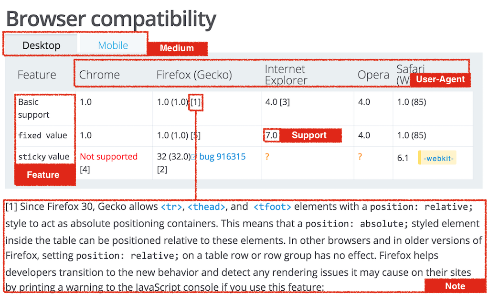
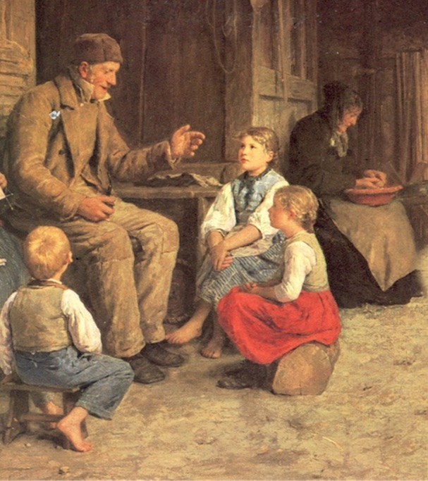
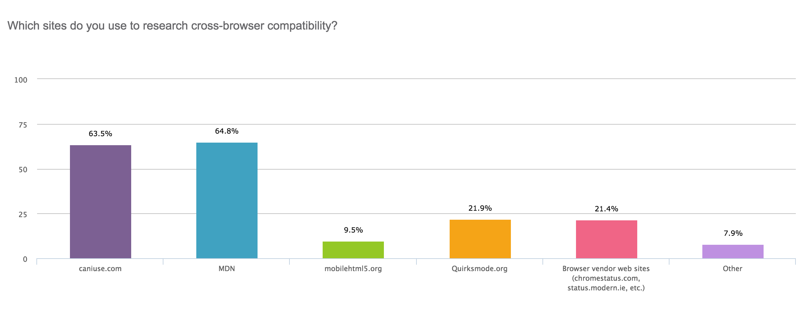
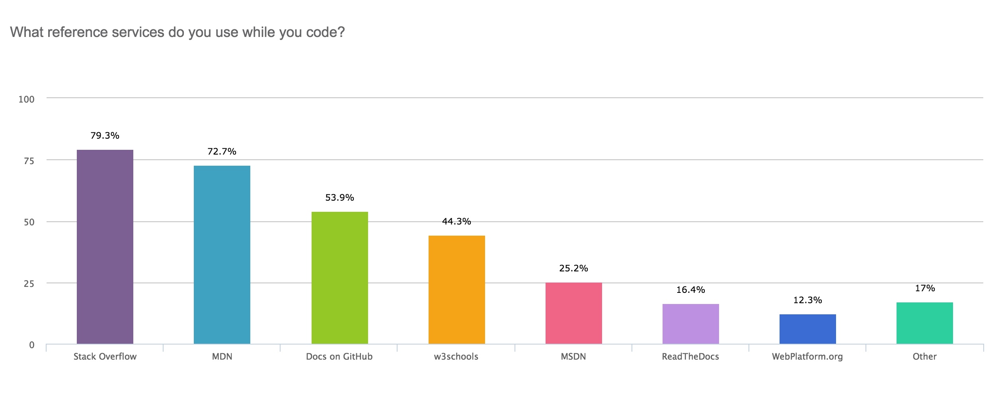
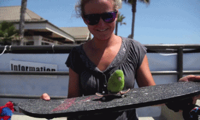
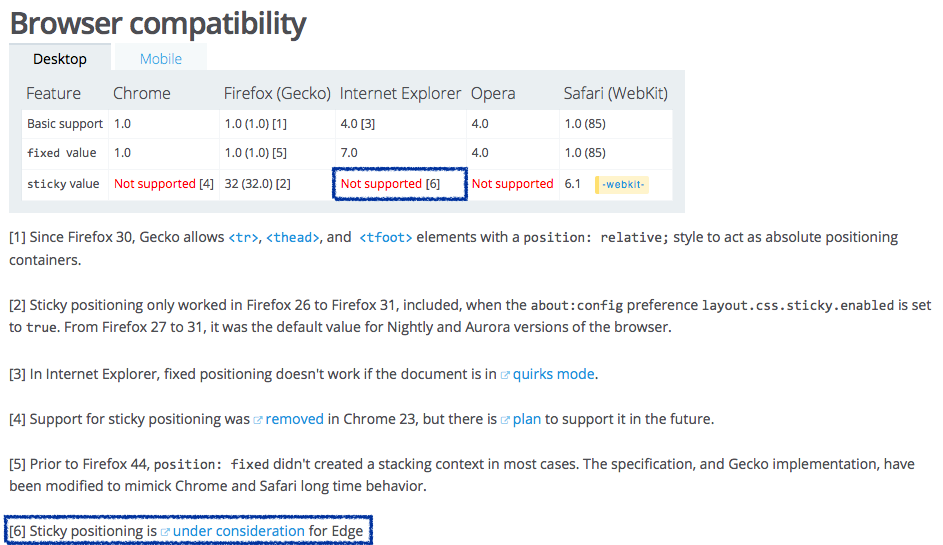
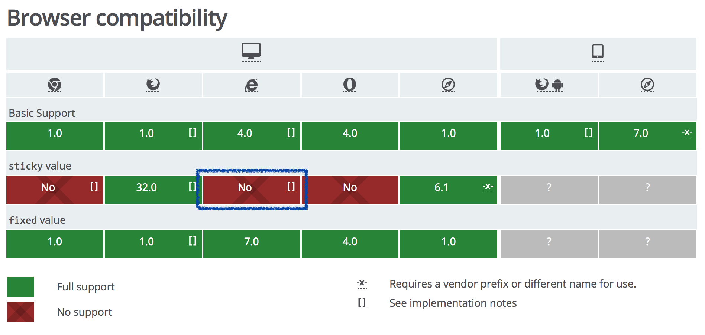

class: first-slide mozilla-branded center

# *Browser Compatibility*<br/> Data Project *vision*


.footnote[
by [@renoirb](https://renoirboulanger.com/#is)
]


???


* Where
* background:
 * I’m a web developer
 * I’ve built a number of websites for clients
 * Most were contracted for graphic design agencies
 * Been asked to make them look the same on every browser
 * Bunch of Photoshop or Illustrator files printed on paper
 * Neck breathing. All that stuff
* Role:
 * Tech Lead for the Browser Compatibility Data project
 * Sub project of MDN; Mozilla’s web developer documentation


# Scratchpad

## Skeleton

1. What we're trying to do
1. Competition
1. Who are our audience:
  - "We should tink of this as a separate system. MDN is one of our client. We’ll have other"
  - "Developers who are making presentation, want an easily identifiable way of getting"
1. Where we are now
1. Where are we headed
1. Are we going in the wrong direction
  - What can we do to improve
  - What we have we should focus on


## Where are people getting data

* Why
  * Not visually apealing
  * Hard


## This is not only MDN, it's about serving compat data

Consumers: X that talks about feature, give nice looking badge
 - as visual aid during a presentation
 - mdn
 - blog
 - products
 - IDE


## Doug:Renoir notes


Target audience:
 - MDN is using it
 - Talking about tech
   - Blogs
   - Presenters
   - Products
All of these might want accurate, up to date, attractive looking representation
consider those as some of our users
assuming that those are our users
Who are our competitors in this space.
The main one bing caniuse
what are some of the flaws with can i use
 - not accurate
 - not up to date
 - OK but not
 ... up to date
There is no systematic way of updating it.
 - NOT DATA Driven
 (automatically)
 - Its too coarse grained
 - Not automatic update .. done manually by people
 ... possibly by people with agenda
Opportunity
Use existing mechanism
W3C Test suites
Where all browser vendors contributes their tests
... there are challenges with this, but its in progress
[2015-10-21, 14:27:47]... gotta set in place a system that gives us flexibility to accept input and eds
People don't use MDN because there's no "data viz" view of the data
... not reuseable
... only meant for MDN


---
class: inverted chapter

# Compatibility tables

.middle[
... one of the **key feature** of <abbr title="Mozilla Developer Network">MDN</abbr>. It **allows** *Web Developers* to **know more** about the **reliability** of any web standard features.
]


---
class: inverted

.figure[

]

???

* Less than 2 y.o.
* Exposing User-Agent feature data support and structuring it
* Original data from MDN
  * more-or-less structured data in wiki
  * Wiki went through at least 2 migrations: MediaWiki, MindTouch and now Kuma
* Kuma
  * Fork of a Django, based on Python
  * One interesting thing: KumaScript ... allows updating things asynchronously
* BrowserCompat:
  * Also uses Django
  * Stores structured data in PostgreSQL
  * Modules: History, REST and serialization Python/Django modules


---
class: inverted

## People wants *reliable* compatibility information

--

* How should, and **Can I use** it?

--

* Under a **Temporary setting**?

--

* Feature *may* get superseeded, <small>where to go?</small>

--

* Link to an issue tracker for a specific browser to follow up


---
name: toc
class: inverted

# Table of Contents

.toc-items[
* [Table of Contents](#toc)
]


---
name: our-goal
class: inverted chapter

# Our goal

.middle[
Make a **Compatibility Data .keyword[API]** on the web to exist
]


---
class: inverted

# To **whom**

## Answer to *far-reaching* audience, make *life easier* for maintainers


``` javascript
var audience = [  "Developers"
                 ,"Architects"
                 ,"Contributors"
                 ,"Vendor representative"
                 ,"Third party"
               ];
```

???

1. **Web Developer** who has an **immediate need for information**
1. **Software Architect** writing technical document
1. **Developers involved in a product** who want to **use compatibility data** within their software
1. **Browser vendor representatives** who want to **update** their **product support data**
1. People who **participate in documentation** and/or **translation**


---
class: inverted middle

## It’s *not only* for *<abbr title="Mozilla Developer Network">MDN</abbr>*


---
class: inverted
background-image: url(images/compat-data-sources-css3test.png)


---
class: inverted
background-image: url(images/feature-testing-tooling-haz.png)


---
class: inverted
background-image: url(images/compat-data-sources-html5test.png)


---
class: inverted middle

## *Specification* editors


---
class: inverted
background-image: url(images/use_cases_wild_csswg.png)

.footnote[
A <abbr title="World Wide Web Consortium">W3C</abbr> spec [for CSS animations](https://drafts.csswg.org/css-animations/#animation)
]


---
class: inverted
background-image: url(images/use_cases_wild_htmlelementinfo.png)


---
class: inverted
background-image: url(images/use_cases_wild_whatwg.png)

.footnote[
A <abbr title="What Working Group, an independent Web Specification group">WHATWG</abbr>  [embedded content](https://html.spec.whatwg.org/multipage/embedded-content.html#the-picture-element) spec.
]


---
class: inverted middle

## And *authors*


---
class: inverted
background-image: url(images/use_cases_wild_2.png)


---
class: inverted
background-image: url(images/webplatform_compat_4.png)


---
class: split-two

.left-column[
.pull-right[
# An *oral* tradition
]
]

.right-column-img[

]


---
class: inverted

## Luckily, <abbr title="Mozilla Developer Network">MDN</abbr> is well-known<br/><small>for compat. data</small>

.figure[

]

.footnote[
**Source**: Mozilla *Public Reports*: [Compatibility Data Survey Q1 2015](http://qsurvey.mozilla.com/reportsview/?key=28049-4099407-a5dd5e6bb02a03f6c2dec0183a31e37e) and [Developer Services Survey Q1 2015](http://qsurvey.mozilla.com/reportsview/?key=28049-4041795-f8a227baddefc3ca7a0eefbd3d5975e1). <br/>Sample isn’t representative of reality as the respondents came from <abbr title="Mozilla Developer Network">MDN</abbr>.
]


---
class: inverted

## Luckily, <abbr title="Mozilla Developer Network">MDN</abbr> is well-known<br/><small>for documentation</small>

.figure[

]

.footnote[
**Source**: Mozilla *Public Reports*: [Compatibility Data Survey Q1 2015](http://qsurvey.mozilla.com/reportsview/?key=28049-4099407-a5dd5e6bb02a03f6c2dec0183a31e37e) and [Developer Services Survey Q1 2015](http://qsurvey.mozilla.com/reportsview/?key=28049-4041795-f8a227baddefc3ca7a0eefbd3d5975e1). <br/>Sample isn’t representative of reality as the respondents came from <abbr title="Mozilla Developer Network">MDN</abbr>.
]


---
class: current-state split-two state-people

.left-column[# Current
* Wikitext editing (<em>messy!</em>)

* No input validation

* No error prevention

* “Copy and paste” translation
]

--

.right-column[# Needs
* Display **up-to-date** User-Agent **feature support** information, **consistently**

* Easing **contribution** and **access** to data

* Easing **moderation** (i.e. prevent spam)

* Easing **translation**
]

.footnote[<strong style="font-size:4em;font-weight:bold;">Users</strong>]


---
class: current-state split-two state-systems

.left-column[# Current
* CPU cycle waste

* Parsing Wikitext is expensive

* Difficult to update

* Can’t scale
]

--

.right-column[# Needs
* **Multiple views** (i.e. What columns we want to display on <abbr title="Mozilla Developer Network">MDN</abbr>)

* **Multiple formats** (JSON, HTML)

* **Multiple languages** (e.g. English, Chinese, Greek, etc.)

* **Search engine** to ease browsing

* **Contribution workflow** to allow editors and browser vendors to add data
]

.footnote[<strong style="font-size:4em;font-weight:bold;">System</strong>]

???

* We have lots of data imported from MDN

* But an issue remain

* **MUCH RICHER** data is available, but...


---
class: adjust-title-overlay
background-image: url(images/data-in-excel-alpha.png)

# <small>&hellip; can’t <em>import</em></small>


---
class: adjust-title-overlay
background-image: url(images/data-in-excel-bravo.png)

# <small>&hellip; can’t <em>import awesome</em></small>


---
class: adjust-title-overlay
background-image: url(images/data-in-excel-charlie.png)

# <small>&hellip; can’t <em>import awesome data</em></small>

???

We’ll other challenges very soon

1. Accept manual editions
1. Import from authoritatives

Which superseeds which, how?


---
class: inverted

# Vision

.middle[
Serve feature compatibility information across multiple **outlets** and **formats** *without* data duplication
]


---
class: inverted

## We’re *building*

* **Specialized web service** ("API") serving feature support data in multiple languages (e.g. English, French, German, etc.) and formats (JSON, HTML)

--

* **Dashboard** to allow maintenance and moderation of data

--

* **Search engine** to ease **browsing** Features, Specifications, Browser, Browser Version

--

* **Contribution interfaces** to enable third party contributions


---
class: inverted

## To *add value*

--

* Serving **reusable utilities** to support **Web Development Industry**

--

* Help **browser vendors** to **contribute** to MDN

--

* Help third party to **use and display consistent** cross-browser information.

--

* Improve resiliency and maintenance of **MDN** and infrastructure

--

* Support Mozilla mission by providing a canonical resource about cross compatibility of standards web technologies


---
class: inverted middle

# Next generation <br/>*Compatibility Data*


---
name: how-others
class: inverted middle chapter

# How *others* are doing it?


---
class: split-two

.left-column[# Two

## Manual

* [Can I Use](http://caniuse.com)

* [MDN](http://developer.mozilla.org "Mozilla Developer Network")
]

--

.right-column[# approaches

## <abbr title="Test Driven Development">TDD</abbr>

* [Web Browser Compatibility .com](http://webbrowsercompatibility.com/)

* [Web Platform Test](http://w3c-test.org/svg/import/animate-dom-01-f-manual.svg "SVG Animate DOM test case on Web Platform Test suite")

* [Modernizr](https://modernizr.com/)

]


---
class: inverted background-title
background-image: url(images/other-compat-sites-caniuse.png)

.footnote[
## [Can I Use <small>.com</small>](http://caniuse.com/)
]


---
class: black-background middle
background-image: url(images/use_cases_wild_caniuse-cmd.png)

.footnote[
[Can I Use <small>.com</small>](http://caniuse.com/) Node.js command line client.
]


---
class: inverted background-title
background-image: url(images/other-compat-sites-webbrowsercompatibility.png)

.footnote[
## [Web Browser Compatibility](http://webbrowsercompatibility.com/)
]


---
class: inverted background-title
background-image: url(images/other-compat-sites-html5please.png)

.footnote[
## [HTML5 Please <small>.com</small>](http://html5please.com/)
]


---
class: inverted  background-title
background-image: url(images/other-compat-sites-mobilehtml5.png)

.footnote[
## [Mobile HTML5 <small>.org</small>](http://mobilehtml5.com/)
]


---
class: inverted background-title
background-image: url(images/other-compat-sites-w3schools.png)

.footnote[
## [W3 Schools](http://www.w3schools.com/cssref/css3_browsersupport.asp "W3 Schools. A site that is NOT RELATED to the W3C")
]


---
class: inverted background-title middle
background-image: url(images/use_cases_wild_1.png)

.footnote[
And old ones too such as [GTalbot.org’s DHTML Section](http://www.gtalbot.org/DHTMLSection/).
]


---
class: inverted background-title middle
background-image: url(images/webplatform_compat_2.png)

.footnote[
## WebPlatform Docs
]

???

* Took the "MVP" aproach, made a "good enough" MDN crawler
* Couldn’t import all data MDN was hard to crawl
* BrowserCompat didn’t exist
* Created a minimal JSON format inspired by caniuse format


---
background-image: url(images/webplatform_compat_caching_strategy.png)

# Caching strategy

<!--
title Compatibility Table Caching strategy

Client->Fastly: GET ...?topic=css&feature=position
note right of Fastly: Checks Vary, if has copy
Fastly->Frontend: I don't have a copy, forwarding
Frontend->Backend:
Backend->Cache:
Cache->Backend: Nothing in cache
note left of Backend: Generate HTML
note right of Backend: check data.json up-to-date
Backend->Cache: Give generated
Backend->Frontend: Give generated
note left of Frontend: Cleanup headers
Frontend->Fastly:
note left of Fastly: Keep a copy
Fastly->Client: <div data-compatable="...">...</div>

-->


---
class: inverted

## MediaWiki Parser function

``` html
<compatibility
  topic="css" feature="position"
  format="table" />
```
``` html
<esi:include
* src="...?topic=css&feature=position&format=table&foresi=1"
  ttl="3600">
  <div class="compat-parent compat-position compat-topic-css"
    data-comment="Generated on 2015-10-21T13:33:33-04:00"
    data-hash="..."
*   data-timestamp="Fri, 13 Mar 2015 15:55:22 GMT"
    data-cachekey="wpwiki:compatables:table:css:position"
*   data-source="https://docs.webplatform.org/compat/data.json"
    data-feature="position"
    data-topic="css"
    data-canonical="...?topic=css&feature=position&format=table">
       <section data-browser-type="desktop">
        <h3 id="Desktop-2">Desktop</h3>
        <table class="compat-desktop"><!-- ... --></table>
       </section>
  </div>
</esi:remove>
```

???

* Initial was using SemanticMediaWiki. Like MDN.
* First compat tables sprint, in 2013 was generating table at every page view
* Two caching mechanism
  * ESI with Varnish
  * Store generated HTML in Memcache
* Exposed way to get only the table HTML


---
class: inverted middle
background-image: url(images/webplatform_compat_1.png)

.footnote[
We could get table only HTML partial. Useful for ESI.
]


---
class: inverted

# Contributing

``` javascript
cat data.json | underscore extract 'data.css.position'
{ "breadcrumb": ["css", "position"],
  "contents": {
    "desktop": {
      "Basic support": {
        "Chrome": { "1.0": "y" },
        "Firefox": { "1.0": "y" },
        "Internet Explorer": { "4.0": "y" },
        "Opera": { "4.0": "y" },
        "Safari": { "1.0": "y" }
      }, "fixed value": {
        "Chrome": { "1.0": "y" },
        "Firefox": { "1.0": "y" },
        "Internet Explorer": { "7.0": "y" },
        "Opera": { "4.0": "y" },
        "Safari": { "1.0": "y" }
      }, "sticky value": {
        "Chrome": { "?": "u" },
        "Firefox": { "32": "y", },
        "Internet Explorer": { "?": "u" },
        "Opera": { "?": "u" },
        "Safari": { "6.1": "x" }
    }}, "mobile": {/* ... */}}, "links": [{/* ... */}]}
```


---
class: inverted middle
background-image: url(../Achieve-consistent-deployments-leveraging-packaging/images/mediawiki-git-comparing-commits.png)

.footnote[
WebPlatform is going to have its content migrated from MediaWiki into Git.
]


---
class: inverted middle
background-image: url(images/webplatform_compat_3.png)

.footnote[
Don’t have an API. Data contributions made through GitHub.
]


---
class: inverted

## What they have in common?

???

* Simple and leverage proven tools
* Flexible and require almost nothing

--

* Leverage source-control

--

* Flat files

--

* Re usable formats


---
class: inverted

## But...


* **Read-only** HTTP API

???

* No human-friendly UI
* No history management

--

* Uses either **manual**, *OR* **test driven**

--

* "Deal with it" API


---
name: where-we-are
class: inverted chapter middle

# *Where* we’re at

.footnote[
As of Q4 2015
]


---
background-image: url(images/initial-workflow.png)

## Complexities

.footnote[
Lots of underlying data, hard to import them all. It’s a *one time* import.
]


---
class: inverted

## Skateboard<b style="display:block;float:right;"></b>

--

* Keep editing with wikitext

--

* Migrate all data out of <abbr title="Mozilla Developer Network">MDN</abbr>

--

* Gradual rollout (i.e. limit per user groups)

--

* Clean the slate, switch to *BrowserCompat*


---
class: adjust-title-overlay inverted
background-image: url(images/before-after-kuma-reload.png)

## Skateboard?

.footnote[
Let’s ensure Kuma, or any other relier, has only to get "readymade" HTML tables from BrowserCompat.
]


---
class: inverted middle
background-image: url(images/before-after-webapp-importer.png)


---
class: inverted middle
background-image: url(images/before-after-initial.png)

.footnote[
**Old tables, on <abbr title="Mozilla Developer Network">MDN</abbr>**
(not signed-in)
]


---
class: inverted middle
background-image: url(images/before-after-webapp.png)

.footnote[
**Browsing browsercompat.org**
]


---
class: inverted middle
background-image: url(images/before-after-skateboard.png)

.footnote[
**New tables, on <abbr title="Mozilla Developer Network">MDN</abbr> "Skateboard"**
(signed-in with feature flag active)
]


---
class: black-background
background-image: url(images/hyperspace.jpg)


---
name: phases
class: inverted middle chapter

# Phases

<!--
1. Skateboard
1. Tricycle
1. Motorcycle
1. Car
1. X-Wing
1. Foundation’s Gravitic ship
-->


---
class: inverted phases

## *Skateboard* phase <b style="display:block;float:right;"></b>

### What

* Contributors **fix import problems**
* Developers work on *prime <abbr title="Beta">&#x3d0;</abbr>* requirement: **Contributor interface**

--

### Milestone

* Contributors can work on fixing problems
* Load tested service, and it responded well


---
class: inverted phases

## *Tricycle* phase *<abbr title="Beta">&#x3d0;</abbr>*

### What

* Plan and Deploy to *browsercompat.org*, good enough caching
* Contributor interface <small>(outside of MDN)</small>
* Ready-made `HTML` tables partials generator
* Review API signatures to optimize caching opportunities

--

### Milestone

* Imported *accepted quantity* of compatibility data from <abbr title="Mozilla Developer Network">MDN</abbr>
* Can get contributions within BrowserCompat from signed-in <abbr title="Mozilla Developer Network">MDN</abbr> users
* Tables visible to all


---
class: inverted phases

## "*Motorcycle*" phase

### What

* Contribution flow within MDN
* Accepting larger data sets
* Moderation

--

### Milestone

* Removed compat data from <abbr title="Mozilla Developer Network">MDN</abbr> content
* When <abbr title="BrowserCompat">BC</abbr> can accept data entry from MDN, BC, and bulk
* When we can let subset of BC users to send bulk data


---
name: data-sources
class: inverted middle chapter

# Sources of data


---
class: inverted middle

## *Interpretation* of *raw* test results


---
class: inverted
background-image: url(images/feature-testing-community-ttwf.png)

???

* [W3C’s "*web-platform-test*" tests suite](https://github.com/w3c/web-platform-tests)

* From community efforts, such as [kangax/compat-table](https://kangax.github.io/compat-table/es5/)

* **In-browser** test **runs** and **submitted by users**


---
class: inverted middle

## How to *define* "supported"


---
class: inverted
background-image: url(images/other-compat-sites-kangax-ecma.png)


---
class: inverted
background-image: url(images/feature-testing-tooling-csswg.png)

.footnote[
CSS Working Group [Animation Module Level 1 Test Suite](https://test.csswg.org/harness/results/css-animations-1_dev/grouped/)
]


---
class: inverted
background-image: url(images/compat-data-sources-acidtests.png)


---
class: inverted middle

## They&nbsp;aren’t&nbsp;all&nbsp;obvious to&nbsp;test&nbsp;*accurately*


---
background-image: url(images/data-in-excel-bravo.png)


---
background-image: url(images/svgtest.gif)


---
class: inverted middle

## Browser vendors themselves


---
class: inverted
background-image: url(images/vendor-status-apple.png)

.footnote[
[Apple **WebKit** Dev team](https://www.webkit.org/status.html)
]


---
class: inverted
background-image: url(images/vendor-status-google.png)

.footnote[
[Google **Chromium** Dev team](https://www.chromestatus.com/features)
]


---
class: inverted
background-image: url(images/vendor-status-microsoft.png)

.footnote[
[Microsoft **Edge** Dev team](https://dev.modern.ie/platform/status/)
]


---
class: inverted
background-image: url(images/vendor-status-mozilla.png)

.footnote[
[Mozilla platform status "**Platatus**" project](https://github.com/mozilla/platatus)
]


---
name: how-work
class: middle inverted chapter

# How it’ll *work*


---
class: inverted

.figure[

]

.footnote[
Internet Explorer’s `position: sticky` CSS property support
]


---
class: inverted

# How it’ll *work*

1. **Walking the API**
2. Asking a *view*


---
class: inverted middle

## 1. *Walking* the API

Let the *Web* **read everything**.


---
class: inverted

### The `position` CSS property

The *raw stuff*.

``` http
*GET /api/v1/features?slug=web-css-position HTTP/1.1
Host: browsercompat.org
*Accept: application/vnd.api+json

Age: 2165
Vary: Accept
Cache-Control: public, max-age=30, s-max-age=360

// ... Response body
```


---
class: inverted

### ... from *a feature*, we can jump

``` json
{ "features": [
    { "id": "814",
      "name": "position",
      "obsolete": false,
      "slug": "web-css-position",
      "stable": true,
      "standardized": true,
      "experimental": false,
      "links": {
*       "children": ["7158","7157"],
        "parent": "581",
        "supports": ["337","338","339","340","343"]
  }}], "links": {
    "features.children": {
*     "href": "/api/v1/features/{features.children}"
    }, "features.parent": {
      "href": "/api/v1/features/{features.parent}"
    }, "features.supports": {
      "href": "/api/v1/supports/{features.supports}"
    }}
}
```

.footnote[
Note: this is a shortened API response body
]


---
class: inverted

### ... to a *child feature*, such as **`sticky` value**

``` http
*GET /api/v1/features/7158 HTTP/1.1
Host: browsercompat.org
Accept: application/vnd.api+json
```

``` json
{ "features": {
    "id": "7158",
    "slug": "web-css-position_sticky_value",
    "mdn_uri": null,
    "experimental": false,
    "standardized": true,
    "stable": true,
    "obsolete": false,
*   "name": {"en": "<code>sticky</code> value"},
    "links": {
*     "supports": ["349", "350", "351", "352", "353"],
      "parent": "814",
      "children": []
  }}, "links": {
    "features.supports": {
*     "href": "/api/v1/supports/{features.supports}"
    }, "features.parent": {
      "href": "/api/v1/features/{features.parent}"
    }, "features.children": {
      "href": "/api/v1/features/{features.children}"
    }}
}
```

.footnote[
Note: this is a shortened API response body
]


---
class: inverted

### ... and how a Browser *supports* it

``` http
*GET /api/v1/supports/351 HTTP/1.1
Host: browsercompat.org
Accept: application/vnd.api+json
```

``` json
{ "supports": {
    "id": "351",
*   "support": "No",
    "prefix": null,
    "prefix_mandatory": false,
    "alternate_name": null,
    "alternate_mandatory": false,
    "requires_config": null,
    "default_config": null,
    "protected": false,
*   "note": {"en": "Sticky positioning is (...)"},
    "links": {
      "version": "151",
      "feature": "7158"
  }}, "links": {
    "supports.version": {
      "href": "/api/v1/versions/{supports.version}"
    }, "supports.feature": {
      "href": "/api/v1/features/{supports.feature}"
  }}
}
```

.footnote[
Note: this is a shortened API response body
]


---
class: inverted

### Which we could be turned in a &lt;table&gt; cell

``` html
<td data-bc-browsers-id="10"
    data-bc-browsers-slug="ie_desktop"
    data-bc-versions-id="151"
    data-bc-supports="351"
    class="bc-supports">
        <abbr class="bc-supports-value"
              data-bc-supports-value="no">No</abbr>
        <a class="bc-note"
           data-bc-note='{"en": "Sticky positioning is (...)"}'>
            <i class="note-icon"></i>
        </a>
</td>
```

.footnote[
Not an actual HTML format proposal.
]


---
class: inverted

.figure[

]

.footnote[
Internet Explorer’s `position: sticky` CSS property support
]


---
class: inverted

# How it’ll *work*

1. Walking the API
2. **Asking a *view* **


---
class: inverted middle

## 2. Asking for a *view*

**serve different** data sets and **reports**.


---
class: inverted middle

### `Accept: application/json`

Let me **make my own** HTML


---
class: inverted

### The `position` CSS property **view** as **JSON**

``` http
GET /api/v1/views/1/features?slug=web-css-position HTTP/1.1
Host: browsercompat.org
*Accept: application/json

Age: 2445
Vary: Accept
Cache-Control: public, max-age=30, s-max-age=360

// ... Response body
```


---
class: inverted

### ... one compiled view with all relationships

Read from JSON, with all relationships

``` json
{"linked": {
    "browsers": [{
        "id": "10",
*       "name": {"en": "Internet Explorer for Desktop"}],
    "versions": [{
        "id": "151",
*       "version": "7.0",
        "links": {"browser": "10"}}],
    "features": [{
        "id": "7158",
*       "name": {"en": "<code>sticky</code> value"},
        "standardized": true}],
    "supports": [{
        "id": "351",
        "links": {"feature": "7158", "version": "151"},
*       "note": {"en": "Sticky positioning is (...)"},
        "support": "No"}]
}, "links":{}, "features":{}, "meta":{/* Next slide */}}
```

Beware though, it’s quite bit response body.

.footnote[
Note: this is a shortened API response body
]


---
class: inverted

### ... so I can render a table

... response body continued.

``` json
{"linked": {/* previous slide */},
 "meta": {"compat_table": {
    "notes": {
        "338": 2, "339": 1, "340": 3, "345": 7, "349": 4
    }, "supports": {
        "814":  {"10": ["340"], "11": ["341"], "14": ["342"]},
        "7157": {"10": ["346"], "11": ["347"], "14": ["348"]},
*       "7158": {"10": ["351"], "11": ["352"], "14": ["353"]}
    }, "tabs": [{
        "browsers": ["3", "6", "7", "10", "11", "14", "15"],
        "name": {"en": "Non-Browser Environments"}
}]}}, "links":{}, "features":{}}
```

.footnote[
Note: this is a shortened API response body
]


---
class: inverted middle

### `Accept: text/html+partial`

**Ready-made** HTML


---
class: inverted

### The `position` CSS property **view** as **HTML**

``` http
GET /api/v1/views/1/features?slug=web-css-position HTTP/1.1
Host: browsercompat.org
*Accept: text/html+partial

Age: 24
Vary: Accept
Cache-Control: public, max-age=30, s-max-age=360

// ... Response body
```

.footnote[
`Accept: text/html+partial` needs to be confirmed.
]


---
class: inverted

### ... Copy. Paste. Done. ✓

``` html
<table class="bc-table"
*      data-bc-features="814">
  <thead>
    <tr class="bc-mediums"><th>Desktop</th><th>Mobile</th></tr>
    <tr class="bc-browsers">
*     <th data-bc-browsers="10">Internet Explorer</th>
      <!-- ... other browsers -->
    </tr></thead><tbody>
    <tr data-bc-features="7158">
      <!-- A "Tile"; Or a relationship between a "medium", -->
      <!-- a browser, a browser version, a feature,        -->
      <!-- a child-feature, and a support value.           -->
*     <td data-bc-supports="351"
*         data-bc-browsers-id="10"
          data-bc-versions-id="151">
        <abbr data-bc-attr="support">No</abbr>
        <a class="bc-note"
           data-bc-note='{"en": "Sticky positioning is (...)"}'></a>
      </td><!-- ... other supports columns -->
    </tr><!-- ... other child features rows -->
  </tbody>
</table>
```

.footnote[
We [already have something similar](https://browsercompat.herokuapp.com/api/v1/view_features/814?format=html). But it's not flexible enough.
]


---
class: inverted

.figure[

]


---
class: middle
# *REMAINDER IS SCRATCHPAD*


---
name: processes
class: inverted middle chapter

# Processes


???

* How we’ll drive the development work
* Focus on benefits for users, not just engineering
* Just in time Agile


---
class: inverted

# Processes

* Setup what we need to measure so we can make **informed decisions**

--

* Commit to possible deliverables, with a clear **definition of done**


---
name: building-blocks
class: inverted middle chapter

# Building blocks


---
background-image: url(images/table_views_naked_table.png)

## An *HTML* table in its **simplest form**


---
background-image: url(images/table_views_naked_table_hover.png)

## **Add behavior** when user interacts


---
background-image: url(images/table_views_values_tile.png)

## The "Tile"


---
background-image: url(images/table_views_values_tile_legend.png)

## The "Tile" <br/><small>legend</small>


---
name: feel
class: middle inverted chapter

# How it’ll *feel*


---
class: inverted middle

1. **On a relying site**
2. From the web application


---
background-image: url(images/table_views_real_table_1.png)

## The `position` CSS property, <small title="embedded within Mozilla Developer Network site">on MDN</small>


---
background-image: url(images/table_views_real_table_2.png)

### When a note exists <br/><small>(on hover)</small>


---
background-image: url(images/table_views_real_table_3.png)

### When a note exists <br/><small>(on click, add edit capability)</small>


---
background-image: url(images/table_views_real_table_4.png)

### When a prefix exist


---
background-image: url(images/table_views_display_bravo.png)

### Alternate interaction <br/><small>(on click, expands a drawer)</small>

.footnote[
Suggested interaction: **Click on a cell** to get more details
]


---
background-image: url(images/table_views_real_table_5.png)

### When no note, nor prefix exists <br/><small>(on click, add edit capability)</small>


---
background-image: url(images/table_views_real_table_6.png)

### Let’s go in edit mode


---
background-image: url(images/table_views_edit_mode_1.png)

### 1

.footnote[
Show changed domain name to browsercompat, in edit mode at the right feature
]


---
background-image: url(images/table_views_edit_mode_2.png)

### 1

.footnote[
Label everything to discuss what we see
]


---
background-image: url(images/table_views_edit_mode_3.png)

### 3

.footnote[
Show search facet helper
]


---
class: middle

# EOF


---
name: colors
class: black-background

<!-- 23241f -->

# Color tests

.center[

]


---
class: black-background adjust-title-overlay
background-image: url(../../funstuff/fail-simpson-burn-cereals.jpg)

# With **title** `overlay` <small>(inverted)</small>


---
class: adjust-title-overlay
background-image: url(images/data-in-excel-alpha.png)

# With **title** `overlay` <small>(default)</small>


---
class: black-background

## Testing *one* .keyword[two] **three** <small>(black)</small>

* Hi [mom](#mom)!
* Testing `keyword`

``` css
foo { background-color: purple; }
```

And *of course*, **bleh**, <abbr title="Dog">DAWG</abbr>

``` js
var hi = 'dude';
```

.figure[

]


---
class: inverted

## Testing *one* .keyword[two] **three** <small>(inverted)</small>

* Hi [mom](#mom)!
* Testing `keyword`

``` css
foo { background-color: purple; }
```

And *of course*, **bleh**, <abbr title="Dog">DAWG</abbr>

``` js
var hi = 'dude';
```

.figure[

]

---

## Testing *one* .keyword[two] **three** <small>(default)</small>

* Hi [mom](#mom)!
* Testing `keyword`

``` css
foo { background-color: purple; }
```

And *of course*, **bleh**, <abbr title="Dog">DAWG</abbr>

``` js
var hi = 'dude';
```

.figure[

]
