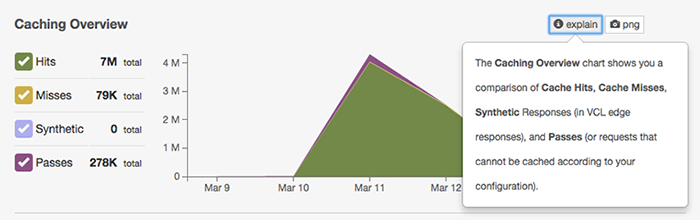
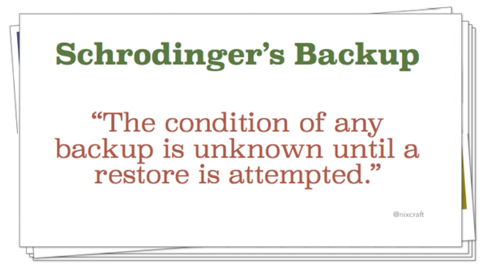

class: first-slide mozilla-branded center
# Achieve *consistent* deployments by leveraging<br/> *packaging*


.footnote[
 **bit.ly/2015-renoirb-talk-packaging** ✪ [@renoirb](https://renoirboulanger.com/)
]

???

- Ask *switch to french*
- Slides available, link at the bottom
- Automation is nice, but how much is it helping you?
- Ever been caught
  - (dependencies) while trying to rebuild service host
  - (dependencies) onto something then *provider asks you to move* all services elsewhere
  - to cross-fingers because you don't remember what magic you did?
- It's all about making things consistent.


---
class: mozilla-branded center


---
background-image: url(images/People-of-the-W3C-2013.png)


---
background-image: url(images/webat25_browser.png)


---
class: webat25
background-image: url(images/google-doodle-webat25-browser.png)

???

- Had to learn quickly how HTTP caching works

- Could not trust all metrics, under the "fire"


---
class: center spike


--



---
class: webplatform center invert-slide-number
background-image: url(images/webplatform-docsprint-perk.jpg)

# My last two years


.footnote[
 **webplatform.org** perk given during our first *DocSprint*
]

???

**When I arrived**

- ~20 VMs
- If Salt Master break. Doom.
- If service died, ... *only* aremysitesup.com would tell me ... *NO* monitoring
- To change secrets or add servers, had to find the right file and edit manually
- Not *everything* was source-controlled
- Patched-up code forking original project
- Adding SSL to the whole site was a lot of work!


---
background-image: url(images/poorman-monitoring.png)


---
class: center middle background-title invert-text webplatform-components
background-image: url(images/webplatform-components.jpg)

# Lots of moving parts

???

**Wasn't that bad**

- If X break ... add another origin, update Varnish
- *Almost* all VMs could be built from scratch

**The stack**

- Running almost every web technology
- Not all projects were easy put a theme on
- Running Salt Stack, with bunch of repo clones rsyncing' around


---
## Easy != Simple

> Simplicity is prerequisite for reliability.
>
> — Edsger Dijkstra

.footnote[
 **hint** press "*p*" to see speaker notes.
]

???

- Think again on how you do things
- Is this component crucial to the infrastructure.
- What if HELL break loose
- How long can I recover from that component?


---
class: center

## Re-build every service from scratch *still* takes *~5 hours!*

???

- Most of what takes time is dependencies
- Had to do two full datacenter migration(!)


---
class: toc

## Contents

1. **Why packaging?**
1. Ideas
1. Live demo!


---
class: center middle

# Why packaging?


---
class: brave-new-world
background-image: url(images/Aldous_Huxley_Brave_New_World_cover.jpg)


???

**Pros**
- VMs are cheap
- Code as infrastructure
- Lots of tools at many levels
- Automation is easier than before

**Cons**
- automation waste
- dependency on Heroic efforts

ref: [Forbes 11 DevOps bottlenecks][forbes-common-devops-bottlenecks]


---
## Package management is *borken*

--
* Can’t rely on OS level packages

--
* Version pinning == unreliable

--
* Don’t rely on OS level runtime!

???

In order to consistently rebuild a server you have to question everything, all the time.


---
## Goals

--
* Can rebuild any service. *Anytime*.

--
* As **FAST** as possible

--
* Reduce risk of broken dependencies


---
class: ping-pong
background-image: url(images/ping-pong-plates-and-pack-of-gravity.gif)


---
class: rules
background-image: url(images/movie-saw-doll-puppet-on-bike.jpg)

## Rules

--
1. Give yourself tools to **work locally**

--
2. Build from vanilla, set a "*base*" system, ...

--
3. **NO** manual operations

--
5. Source control everything

--
4. **DON'T** rely on external.


---
class: all-the-things center

### Package *ALL THE THINGS* !!1

.footnote[
  ... and make **’em available** to *download through* **HTTP**
]


---
### ... tools to help you not rely on external

* [Python **PyPI** devpi][devpi]
* [Docker distribution][docker-registry]
* [NPM][npm-registry]
* [PHP Composer][composer-registry]
* [Ruby Gems w/ Bundler][ruby-registry]
* [Create your own DEB/RPM **jordansissel/fpm**][fpm-repo]


---
## Deployment flow

--
1. Get code from VCS <small>or *prebuilt* package</small>

--
2. Initialize runtime environment <small>(e.g. *virtualenv*)</small>

--
3. Initialize dependency managers <small>(e.g. *npm*)</small>

--
4. Install **utilities** and **monitoring** <small>(e.g. *pm2*, *systemd*, *Monit*)</small>


???

**Containers**

- Steps 2-4 would be launched within `Dockerfile`
- Results in a commit + tag
- If your project has tests (lucky you!) and breaks, stop everything
- Push to package Docker Hub


**Don’t use containers**

- Make it a tarball
- Push to package repository
- Make it a DEB/RPM


**Combine**

- Steps 1-3 fills a directory
- Then; tag, tarball, use SHA
- Push to package repository
- Use package to deploy


**NEXT Slide** is about *Schrodigner's box*

---
class: middle

<blockquote class="twitter-tweet" lang="en"><p lang="und" dir="ltr"><a href="https://twitter.com/hashtag/Sysadmin?src=hash">#Sysadmin</a> <a href="https://twitter.com/hashtag/Truth?src=hash">#Truth</a> <a href="https://twitter.com/hashtag/Backup?src=hash">#Backup</a> <a href="https://twitter.com/hashtag/Unix?src=hash">#Unix</a> <a href="https://twitter.com/hashtag/Linux?src=hash">#Linux</a> <a href="http://t.co/suCT9ME58V">pic.twitter.com/suCT9ME58V</a></p>&mdash; nixCraft (@nixcraft) <a href="https://twitter.com/nixcraft/status/613636528439345152">June 24, 2015</a></blockquote>


---
## Go crazy!

--
```terminal
make init && make deps && make install
```


---
class: center middle background-title invert-text
background-image: url(images/build-your-server-with-git-repos.png)

### Build systematically from **VCS**


---
class: center middle background-title invert-text
background-image: url(images/desktop-terminal-deployment-run.png)

### Leverage your configuration manager tool of choice


---
class: center middle background-title invert-text
background-image: url(images/build-assets-steps.png)

### As long as you **enable** your colleagues


---
class: center middle background-title invert-text
background-image: url(images/encapsulating-complexity.png)

### And **encapsulate** complexity


---
class: toc

## Contents

1. Why packaging?
1. **Ideas**
1. Live demo!


---
class: middle center

# Ideas


---

## Some I experimented with

--
* [Using configuration management to apply Docker state](https://github.com/renoirb/fxa/tree/renoirb/docker-build-system)?


--
* [Containerizing webapps with multiple stacks](https://hub.docker.com/r/webspecs/publican/) <small>`docker pull webspecs/publican`</small>

???

Docker is great to do separation of concern and encapsulate.


---
background-image: url(images/docker-container-too-many-layers.png)

???
Other problem is they become cluttered with too many layers


---
background-image: url(images/docker-copy-files-around-manually.png)

???
* Copy manually files around
* Treat them as Virtual Machine


---

## Some I experimented with

* [Using configuration management to apply Docker state](https://github.com/renoirb/fxa/tree/renoirb/docker-build-system)?
* [Containerizing webapps with multiple stacks](https://hub.docker.com/r/webspecs/publican/) <small>`docker pull webspecs/publican`</small>
* Create zip files and sync scripts <small>... yeah.</small>


---
class: toc

## Contents

1. Why packaging?
1. Ideas
1. **Live demo**!


---
class: middle center

# Live demo!


---
class: middle center
## Create an archive of your SSL certificates


---
background-image: url(images/sharing-certificates-archive.gif)


---
class: middle center
## Deploy a webserver with specific featues


---
class: middle center
### Let’s [build this](compile-nginx-video.html)!


---
background-image: url(images/nginx-firefox-protocol-http2.png)


---
class: middle center

# Thank you!


**Questions?**


Links are [available here](links.html).

  [basesystem-example]: https://github.com/renoirb/salt-basesystem "Renoir’s basesystem which also acts as a local workbench"
  [devpi]: http://doc.devpi.net/latest/quickstart-pypimirror.html "devpi, an utility to make your own mirror"
  [renoirb]: http://renoirb.com/#is
  [own-apt-repo]: https://help.ubuntu.com/community/Repositories/Personal "Debian reference document on how to make your own APT repository"
  [docker-registry]: https://github.com/docker/distribution
  [npm-registry]: https://github.com/mixu/npm_lazy
  [composer-registry]: https://github.com/composer/satis
  [ruby-registry]: http://guides.rubygems.org/run-your-own-gem-server/ "RoR registry. Warning, i’m unsure if there’s something more complete than this one"
  [fpm-repo]: https://github.com/jordansissel/fpm
  [forbes-common-devops-bottlenecks]: http://www.forbes.com/sites/mikekavis/2014/12/18/11-common-devops-bottlenecks "11 Common DevOps Bottlenecks"
  [packman]: https://github.com/cloudify-cosmo/packman

